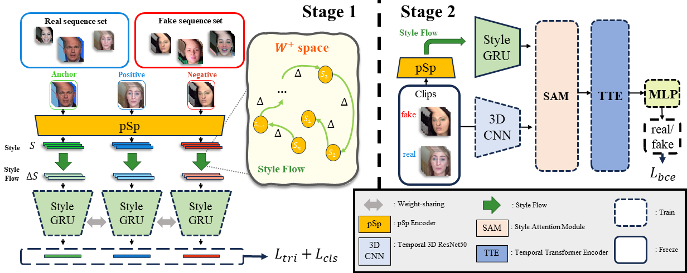

# Exploiting Style Latent Flows for Generalizing Deepfake Video Detection (CVPR 2024)
Jongwook Choi, Taehoon Kim, Yonghyun Jeong, Seungryul Baek, Jongwon Choi*

## Abstract 
> This paper presents a new approach for the detection of fake videos, based on the analysis of style latent vectors and their abnormal behavior in temporal changes in the generated videos. We discovered that the generated facial videos suffer from the temporal distinctiveness in the temporal changes of style latent vectors, which are inevitable during the generation of temporally stable videos with various facial expressions and geometric transformations. Our framework utilizes the StyleGRU module, trained by contrastive learning, to represent the dynamic properties of style latent vectors. Additionally, we introduce a style attention module that integrates StyleGRU-generated features with contentbased features, enabling the detection of visual and temporal artifacts. We demonstrate our approach across various benchmark scenarios in deepfake detection, showing its superiority in cross-dataset and cross-manipulation scenarios. Through further analysis, we also validate the importance of using temporal changes of style latent vectors to improve the generality of deepfake video detection.

<p align="center">

</p>

## Environment

GPU: NVIDIA RTX A6000 48GB

## Deploy

### Test locally with Docker

Create Docker image (docker_username/styleflow:latest) using Dockerfile

```bash
export DOCKER_REGISTRY="{docker_username}"
docker build --no-cache -t "$DOCKER_REGISTRY/styleflow" -f Dockerfile .

```
Run Sanic container.  
map port 8000 on your host to port 8000 in the Docker container.  
SERVER_PORT and first number of -p must be set to an open port number.
```bash
docker run --gpus '"device=0"' -p 8000:8000 --env SERVER_PORT=8000 --name styleflow_sanic docker_username/styleflow
```

If Sanic is running properly, you can see {"healthy": true}.
```bash
curl -X GET http://localhost:8000/healthcheck

```

Usage example.
```bash
curl -X POST http://localhost:8000/predict --data '{"file_path": "https://www.evalai.org/ocasio.mp4"}'
```


## Citation 
```
@inproceedings{choi2024exploiting,
  title={Exploiting Style Latent Flows for Generalizing Deepfake Video Detection},
  author={Choi, Jongwook and Kim, Taehoon and Jeong, Yonghyun and Baek, Seungryul and Choi, Jongwon},
  booktitle={Proceedings of the IEEE/CVF Conference on Computer Vision and Pattern Recognition},
  pages={1133--1143},
  year={2024}
}
```

